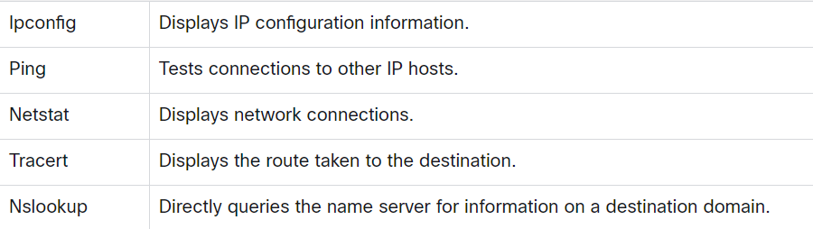

# Commands

## Genral

`proxychains`

## Netstat 

`netstat -tanpl` get routing tables and port connections

## Fancy text

`apt-get install figlet`
Edit the .bashrc file and add: `figlet serverpi` replace serverpi with text
`source ~/.bashrc`

## Onionshare

`apt install snapd` 
`apt install onionshare-cli` for cli only

## TOR

`apt install apt-transport-https`