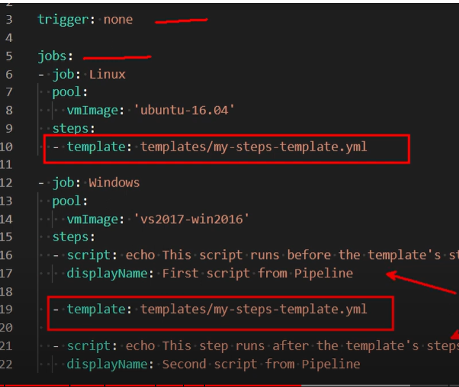

# Commands

## Netstat 

`netstat -tanpl` get routing tables and port connections

## Fancy text

`apt-get install figlet`
Edit the .bashrc file and add: `figlet serverpi` replace serverpi with text
`source ~/.bashrc`