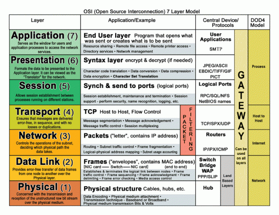

# Network

## Table of contents

- [Network](#network)
  - [Table of contents](#table-of-contents)
  - [Network Types](#network-types)
  - [Device Types](#device-types)
  - [Protocols](#protocols)
  - [OSI](#osi)
  - [ISP](#isp)
  - [Cable types](#cable-types)
  - [Wireless and celluar](#wireless-and-celluar)
  - [Routers](#routers)
  - [LAN Wireless Frequencies](#lan-wireless-frequencies)
  - [NAS Network Attached Storage Device](#nas-network-attached-storage-device)
  - [Frquencies](#frquencies)
  - [Media](#media)
  - [Ethernet Frame](#ethernet-frame)
    - [Encapsulation](#encapsulation)
  - [LAN](#lan)
    - [Star Topology](#star-topology)
    - [Bus Topology](#bus-topology)
    - [Ring Topology](#ring-topology)
  - [WAN - WIDE AREA NETWORK](#wan---wide-area-network)
  - [UDP](#udp)
  - [SMB](#smb)
  - [Telnet](#telnet)
  - [NSF](#nsf)
  - [Three way handshake](#three-way-handshake)
  - [TCP/IP model](#tcpip-model)
    - [MAC address table](#mac-address-table)
    - [Internet later \[Layer 3\]](#internet-later-layer-3)
    - [Switches \[Layer 2\]](#switches-layer-2)
    - [FCS Frame Check Sequence](#fcs-frame-check-sequence)
    - [Pysical \[layer 1\]](#pysical-layer-1)
  - [SSH Remote Port forwarding](#ssh-remote-port-forwarding)

## Network Types

1. Peer to pear = 2 devices connected via cable or wifi
   The advantages of peer-to-peer networking:

Easy to set up
Less complex
Lower cost because network devices and dedicated servers may not be required
Can be used for simple tasks such as transferring files and sharing printers
The disadvantages of peer-to-peer networking:

No centralized administration
Not as secure
Not scalable
All devices may act as both clients and servers which can slow their performance

2. Peer-to-Peer Applications = devices acting client and server
   A messaging app would be considiered this type

## Device Types

1. End device = pcs, tables, printers, tv
2. Intermediary device = router, lan, switch, firewall
3. Netowrk media = wireless, lan media, wan media i.e cable and connection types.

4. Modem (Modulator-Demodulator):

Purpose: A modem is responsible for modulating and demodulating analog signals. It converts digital data from a computer or network into an analog signal for transmission over communication lines and demodulates incoming analog signals back into digital data.
Connection: Modems are typically used to connect a local network to the Internet Service Provider (ISP) over various types of communication lines, such as DSL (Digital Subscriber Line) or cable.

5. Router:

Purpose: A router is a device that forwards data packets between different networks. It operates at the network layer of the OSI model and is responsible for determining the best path for data to travel between devices on different networks.
Function: Routers manage the traffic between the local network and the wider internet. They use routing tables to determine the most efficient path for data to reach its destination.

## Protocols

Protocols govern the communications between devices. Handling the transfer of data and interfaces between the machines.

Ethernet - NIC Network Interface Card - commincate in the same network
IP - Get the address for the destination
TCP - Transmition Control Protocol - Transport the information reliably
HTTP - Application of data governs the transfer of html and web data.

## OSI



## ISP

The internet service provider is your link to the internet.
They are a network of connected networks.

The interconnection of ISPs that forms the backbone of the internet is a complex web of fiber-optic cables with expensive networking switches and routers that direct the flow of information between source and destination hosts.

## Cable types

1. DSL = provides high bandwidth, always on, connection using existing land-line telephone wires
2. Copper core

## Wireless and celluar

Cellphone services inclde

- Talking / texting
- data - data plan
- wifi - connecting and hotspot
- location services - gps maps
- payments - wireless transfer online and in store

Almost all mobile devices are capable of connecting to Wi-Fi networks.
If your mobile device does not prompt to connect to a Wi-Fi network, the network SSID broadcast may be turned off.
SSID is the name assigned to a wireless network.
Passphrase is what we normally use as the “wireless password”.

## Routers

Parts
Internet => ISP => Eth0 connection => Switch => Mac Address => IP Address => Packet => Connection to device i.e pc laptop

```ls
Internet
└── ISP
    └── Router
        ├── Firewall
        ├── DNS Server
        └── Eth0 connection
            ├── Switch
            │ └── Wireless Access Point (WAP)
            └── Device
                ├── Gateway
                ├── Mac Address
                ├── IP Address
                └── Packet
```

## LAN Wireless Frequencies


## NAS Network Attached Storage Device

NAS is similar to an external harddrive but it attaches through the network.
They are more than just a hard drive.

Why?

1. Low storage space and one location
2. You cant lose them
3. Access to data from anywhere on any device.

## Frquencies

Which wireless RF band do IEEE 802.11b/g devices use? 2.5Gh

900 MHz is an FCC wireless technology that was used before development of the 802.11 standards.
900 MHz devices have a larger coverage range than the higher frequencies have and do not require line of sight between devices.
802.11b/g/n/ad devices all operate at 2.4 GHz. 802.11a/n/ac/ad devices operate at 5 GHz
802.11ad devices operate at 60 GHz.

## Media

Network media is the way data travels either through wire or wireless interfaces.
The most common is UTP twisted pair cable. A copper ethernet cable colour coded in pairs.
They can be shielded using a mesh of metal around the core

- Common types include Coaxial cable and ethernet cable.
- Fibre optic cabel is a glass or plastic cable. With fibre optic you dont need to wrory about EM interference.

The four main criteria for choosing network media are these:

What is the maximum distance that the media can successfully carry a signal?
What is the environment in which the media will be installed?
What is the amount of data and at what speed must it be transmitted?
What is the cost of the media and installation?

## Ethernet Frame

Netwrok card to netword card transmition.


1. Preamble - Used to get the NIC card insync with the bits being sent to it
2. Start frame deumiter - Tells it that following me will be eathernet frame data
3. Destination Mac Address - destination address of the NIC card it is going to .
4. Source MAC address - source NIC card
5. Length Type - Could be the length of the data (next block) or what type of data it is.
6. Data - the encapsulated data - ipv4 or ipv6 packet of data possibly containing data. TCP or HTTP headers.
7. Frame Check Sequence. The recieving device does error checking in case the signal gets degraded in transmition.

### Encapsulation

The processes by which data can be sent - the OSI model

Each computer message is encapsulated in a specific format, called a frame, before it is sent over the network. A frame acts like an envelope; it provides the address of the intended destination and the address of the source host. The format and contents of a frame are determined by the type of message being sent and the channel over which it is communicated. Messages that are not correctly formatted are not successfully delivered to or processed by the destination host.

The processes of encapsulation and de-encapsulation are very important -- not least because of their practical use, but also because they give us a standardised method for sending data. This means that all transmissions will consistently follow the same methodology, allowing any network enabled device to send a request to any other reachable device and be sure that it will be understood -- regardless of whether they are from the same manufacturer; use the same operating system; or any other factors.


## LAN

Local Area Network

LAN means any local network or group of local networks that come under the same administrative control.
An intranet is a private LAN network for a business.

The networks have a 'Topology' which is there structure for connecting.
i.e. star network and Bus.

### Star Topology

The main premise of a star topology is that devices are individually connected via a central networking device such as a switch or hub. This topology is the most commonly found today because of its reliability and scalability - despite the cost.

Any information sent to a device in this topology is sent via the central device to which it connects. Let's explore some of these advantages and disadvantages of this topology below:

Because more cabling and the purchase of dedicated networking equipment is required for this topology, it is more expensive than any of the other topologies. However, despite the added cost, this does provide some significant advantages. For example, this topology is much more scalable in nature, which means that it is very easy to add more devices as the demand for the network increases.

Unfortunately, the more the network scales, the more maintenance is required to keep the network functional. This increased dependence on maintenance can also make troubleshooting faults much harder. Furthermore, the star topology is still prone to failure - albeit reduced. For example, if the centralised hardware that connects devices fails, these devices will no longer be able to send or receive data. Thankfully, these centralised hardware devices are often robust.

### Bus Topology

This type of connection relies upon a single connection which is known as a backbone cable. This type of topology is similar to the leaf off of a tree in the sense that devices (leaves) stem from where the branches are on this cable.

Because all data destined for each device travels along the same cable, it is very quickly prone to becoming slow and bottlenecked if devices within the topology are simultaneously requesting data. This bottleneck also results in very difficult troubleshooting because it quickly becomes difficult to identify which device is experiencing issues with data all travelling along the same route.

However, with this said, bus topologies are one of the easier and more cost-efficient topologies to set up because of their expenses, such as cabling or dedicated networking equipment used to connect these devices.

Lastly, another disadvantage of the bus topology is that there is little redundancy in place in case of failures. This disadvantage is because there is a single point of failure along the backbone cable. If this cable were to break, devices can no longer receive or transmit data along the bus.

### Ring Topology

The ring topology (also known as token topology) boasts some similarities. Devices such as computers are connected directly to each other to form a loop, meaning that there is little cabling required and less dependence on dedicated hardware such as within a star topology.

A ring topology works by sending data across the loop until it reaches the destined device, using other devices along the loop to forward the data. Interestingly, a device will only send received data from another device in this topology if it does not have any to send itself. If the device happens to have data to send, it will send its own data first before sending data from another device.

Because there is only one direction for data to travel across this topology, it is fairly easy to troubleshoot any faults that arise. However, this is a double-edged sword because it isn't an efficient way of data travelling across a network, as it may have to visit many multiple devices first before reaching the intended device.

Lastly, ring topologies are less prone to bottlenecks, such as within a bus topology, as large amounts of traffic are not travelling across the network at any one time. The design of this topology does, however, mean that a fault such as cut cable, or broken device will result in the entire networking breaking.

## WAN - WIDE AREA NETWORK

Internal = LAN
External = WAN

## UDP

The User Datagram Protocol (UDP) is another protocol that is used to communicate data between devices.

Unlike its brother TCP, UDP is a stateless protocol that doesn't require a constant connection between the two devices for data to be sent. For example, the Three-way handshake does not occur, nor is there any synchronisation between the two devices.

Recall some of the comparisons made about these two protocols in Room 3: "OSI Model". Namely, UDP is used in situations where applications can tolerate data being lost (such as video streaming or voice chat) or in scenarios where an unstable connection is not the end-all. A table comparing the advantages and disadvantages of UDP is located below:

## SMB

A request - response protocol

SMB - Server Message Block Protocol - is a client-server communication protocol used for sharing access to files, printers, serial ports and other resources on a network. [source]

Servers make file systems and other resources (printers, named pipes, APIs) available to clients on the network. Client computers may have their own hard disks, but they also want access to the shared file systems and printers on the servers.

The SMB protocol is known as a response-request protocol, meaning that it transmits multiple messages between the client and server to establish a connection. Clients connect to servers using TCP/IP (actually NetBIOS over TCP/IP as specified in RFC1001 and RFC1002), NetBEUI or IPX/SPX.

How does SMB work?

Once they have established a connection, clients can then send commands (SMBs) to the server that allow them to access shares, open files, read and write files, and generally do all the sort of things that you want to do with a file system. However, in the case of SMB, these things are done over the network.

- polosmb
- 139/445

## Telnet

Telnet is an application protocol which allows you, with the use of a telnet client, to connect to and execute commands on a remote machine that's hosting a telnet server.

The telnet client will establish a connection with the server. The client will then become a virtual terminal- allowing you to interact with the remote host.

Replacement

## NSF

What is NFS?

NFS stands for "Network File System" and allows a system to share directories and files with others over a network. By using NFS, users and programs can access files on remote systems almost as if they were local files. It does this by mounting all, or a portion of a file system on a server. The portion of the file system that is mounted can be accessed by clients with whatever privileges are assigned to each file.

## Three way handshake

Next, we'll come on to discuss the Three-way handshake - the term given for the process used to establish a connection between two devices. The Three-way handshake communicates using a few special messages - the table below highlights the main ones:

Step Message Description

1. SYN A SYN message is the initial packet sent by a client during the handshake. This packet is used to initiate a connection and synchronise the two devices together (we'll explain this further later on).
2. SYN/ACK This packet is sent by the receiving device (server) to acknowledge the synchronisation attempt from the client.
3. ACK The acknowledgement packet can be used by either the client or server to acknowledge that a series of messages/packets have been successfully received.
4. DATA Once a connection has been established, data (such as bytes of a file) is sent via the "DATA" message.
5. FIN This packet is used to cleanly (properly) close the connection after it has been complete.
6. RST This packet abruptly ends all communication. This is the last resort and indicates there was some problem during the process. For example, if the service or application is not working correctly, or the system has faults such as low resources.

## TCP/IP model

Applications
Transport
Internet
Network Access

`ifconfig eth0 10.10.10.1` change or `netmask` `broadcast`


The three fields found in an 802.3 Ethernet frame are the
source physical address,
destination physical address,
frame check sequence

Criteria for choosing a network medium are the distance across which the selected medium can successfully carry a signal, the environment in which the selected medium is to be installed, the amount of data and the speed at which the data must be transmitted, and the cost of the medium and its installation.

### MAC address table

Media Access Control - a name for your device to share its location and ia physical address
Assigned to a NIC
The address is 48 bits or 6 bytes.

Is the `2. Data link` layer of the TCP/IP network interface

All communication methods include a message source, destination, and a transmission medium.


### Internet later [Layer 3]

The Internet Layer of the TCP/IP model aligns with the Layer 3 (Network) Layer of the OSI model. This is where IP addresses and routing live.

A subnet mask is used to divide an IP address into two parts. One part identifies the host (computer), the other part identifies the network to which it belongs. To better understand how IP addresses and subnet masks work, look at an IP address and see how it's organized.

### Switches [Layer 2]

They duplicate the electrical signal of each frame and send it to ports
A switch uses the source MAC address of incoming frames to keep the MAC address table up to date.

A switches performs two functions when it receives a frame:

The switch examines the source MAC address and adds it to the MAC address table if it is not already in the table.
The switch examines the destination MAC address. If the MAC address is in the MAC address table, the frame is sent to the appropriate port. If the MAC address is not in the MAC address table, the frame is sent to all ports that have devices attached except the port the frame came in on.

### FCS Frame Check Sequence

The purpose of the FCS (Frame Check Sequence) field in a frame is to determine if any errors occurred during the transmission and reception. It serves as a means of verifying the integrity of the frame by comparing the computed CRC (Cyclic Redundancy Check) value with the CRC value stored in the FCS field.

### Pysical [layer 1]

Fiber-optic cables can carry very large amounts of data and are used extensively by telephone companies and in backbone networks.

Data is transmitted across a network on media. Modern networks primarily use three types of media to interconnect devices:

Metal wires within cables (copper cable, such as twisted-pair and coaxial cable) - Data is encoded into electrical impulses.
Glass or plastic fibers within cables (fiber-optic cable) - Data is encoded into pulses of light.
Wireless transmission - Data is encoded via modulation of specific frequencies of electromagnetic waves.

Fiber optic media is more expensive than copper cabling used over the same distance. Fiber optic cables use light instead of an electrical signal, so EMI and RFI are not issues. However, fiber optic does require different skills to terminate and splice.

According to the Ethernet standards, each Ethernet frame can carry 46 to 1500 bytes of user data. During the encapsulation process, other fields are added, such as destination MAC address, source MAC address, and FCS. The size of Ethernet frames is normally limited to a maximum of 1518 bytes and a minimum of 64 bytes.


## SSH Remote Port forwarding

Securely accessing a computer over a network by redirecting traffic from one port to another.
A type of tunneling.

You set up a secure tunnel between the client and host machines. The SSH protocol will encrypt the data being sent.

Benifits are that it is a easy way to connect to a machine securely.


