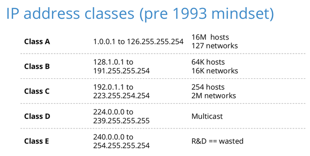

# Networking Starter

## Table of contents

- [Networking Starter](#networking-starter)
  - [Table of contents](#table-of-contents)
  - [IP v4/v6](#ip-v4v6)
  - [Linux files](#linux-files)
  - [Bash Scripting](#bash-scripting)
    - [Example](#example)
  - [Powershell .ps1](#powershell-ps1)
  - [Linux / Bash Commands](#linux--bash-commands)
  - [Linux key commands](#linux-key-commands)
  - [Sudo](#sudo)
  - [Permissions](#permissions)
  - [Bash Coding](#bash-coding)
  - [Linux Tools](#linux-tools)
  - [Extension Commands](#extension-commands)
  - [Protocals](#protocals)
  - [Notes](#notes)
  - [Virtual Machines](#virtual-machines)
    - [Securing VM](#securing-vm)
    - [Machines](#machines)
    - [Creating DHCP server](#creating-dhcp-server)
  - [DNS servers](#dns-servers)
    - [Sharing files](#sharing-files)
    - [Kali Linux](#kali-linux)
  - [SSH Secure Shell](#ssh-secure-shell)
    - [Generate SSH Keys](#generate-ssh-keys)
  - [NMAP](#nmap)
    - [Tools](#tools)
  - [Important Data](#important-data)
  - [Procesess](#procesess)
  - [Spidering](#spidering)
  - [Installing systems](#installing-systems)
  - [User Permissions](#user-permissions)
  - [Apache Web Server](#apache-web-server)
  - [Email](#email)
  - [Routers](#routers)
  - [NAT Network Address Translation](#nat-network-address-translation)
  - [WAN](#wan)
  - [Important Websites](#important-websites)

## IP v4/v6

Static = manually set
Dynamic = changed as need by dhcp server

Ip addresses

IPv4 Classes:


IPv4 is a 32 bit binary number in 4 octets.
They have subnet masks to increase there number.

## Linux files

1. Bin - Binary files, contains commands like ls and cat.
2. sbin - Admin binary files - single user mode as root user access.
3. boot - boot menu - os and boot loaders
4. cdrom - legacy
5. dev - Devices - where they live. In linux everything is a file including disc i.e sda file. and webcam and keyboard.
6. etc - etcetera - where config files are stored for system wide resources ie apt. Not a user defined
7. lib/32/64 - Library storage - bin and sbin require this
8. media - Drives - flashdrives, external hardrive
9. mnt - Media for mounting manually
10. opt - store your manually create system files
11. proc - Process - sudo files for system prcess and resources - `cat /proc/cpuinfo` get data
12. root - Root users home folder - different to home - need root permissions to store here
13. run - Newer - Temp Fs file system that runs in RAM - resets and doesnt save after shutdown
14. snap - Snap packages are stored here, used in umbuntu
15. srv - Service directory - if you run a server the access files will be stored here - better security due to root position
16. sys - System folder - interact with the Kernal - change settings on graphic cards - created on boot up - nothing install
17. tmp - Temporary - temp files stored for sessions
18. usr - User Application Space - apps will be install used by user - unlike bin which is used by system, non essential files
19. var - Variable - files and directories that will grow in size - crash logs, logs, databases, tmp
20. home
    1. Store personal files
    2. Each user has there own
    3. Contains many dirs that store app settings
    4. Hidden dirs start with a .
    5. ls -a for all files to be shown including hidden
    6.

## Bash Scripting

BASH (Bourne Again Shell)
It is the command line in Linux
You need to add the shebang (#!), with what script type.

To run code you can

`bash file.sh`
`./file.sh` this will give you a permission denied response. Be sure to run `chmod 777`
`date=$(date)` use a bash command in the code `$(pwd), $(whoami)`
`#RANDOM` i.e echo #RANDOM. other randoms exist

You can create you own variables
`twitter="Elon Musk"`
`echo twitter` = Elon Musk
`export twitter` to create a variable used by children
You will still need to save the variables to the `.bashrc` file, then they save from reboots

What is bashrc?

Bashrc use bash code to set up all your code you want to run on start up
You can also get `env` variables in here

MATH

`echo $(( 2 + 3 ))`

### Example

```BASH
#!/bin/bash
name="Tom"
date=$(date)

echo 'Hello World'
echo "Hello $name"

echo "Enter your name $date"
read name
```

```BASH
#!/bin/bash
name=$1 # this is the first param entered from bash i.e. `./file.sh tom`
```

IF

```bash
echo "Hey deo you like coffee? (y/n)"

read coffee

if [[ $coffee == "y" ]]; then
        echo "Youre awesome"
else
        echo "leave right now"
fi


```

## Powershell .ps1

`Invoke-RestMethod` is a cmdlet in PowerShell that is used to send HTTP requests to

## Linux / Bash Commands

- `sudo su` Log in as Super user (root)
- `touch file.js` Create file
- `echo var tom = 10 > file.js` Write to file
- `cat file.js` Read file
- `shred file.js` Encode file prevent being seen in text by cat
- `nano file.js` Edit file and to save press `ctrl + x + y + Enter` nano is a text editor
- `cp file.js ./location/file.js` Copy file
- `mv file.js ./location/file.js` Move file
- `rm file.js` Remove/delete file
- `rmdir directory/` Remove/delete directory `-r` for recursive
- `man` Get info on command + a command i.e `man cat`
- `wget http://` Get data from the internet using url
- `curl http://localhost: > file.txt` Get and save
- `find / -name "*Search term*"` Find files the slash is where to search meaning everywhere
- `ifconfig` Get ip address `ip a` NEW
- `which cat` Find command root location
- `date` get date - day month calanderday time am/pm utc year
- `grep` Search for text in files - By default grep is case sensitive
- Check IP `ping 8.8.8.8`
- Check ip data `route`
- Change permissions to all `chmod 777 file.txt`
- List files and permissions `ls -la`
- APR check connections `arp -a`
- Start and stop services `service` i.e web server, ssh
- Update linux `sudo apt update`
- Open multi terminal `tilix`
- Search for a word `grep -i "word" file.txt` the -i means case insensitive
- `wc -l file.txt` word count per line
-

## Linux key commands

- Create a file an edit in GNU `nano file.txt`
- `ls` Read file
  - `ls -a` hidden files `ls -al` hidden files in a table `ls- ah` human readable table
  - `ls -lR Desktop` search for all files and sub directories in a location i.e Desktop.
- File read `impacket-secretdump -sam sam.save -system system.save LOCAL`
- `find` Find has many options `find -size 1024c`
- `!` do the opposite `! -executable` find not executable file
- `file` can find human readable files
  - File Sizes
  - `b` = 513 byte blcok
  - `c` = bytes
  - `w` = two-bye words
  - `k` = 1024 bytes 1KB
  - `M` = 1048576 bytes 1MB
  - `G` = 1073741824 bytes 1GB
- `sort` This command sorts the lines of text in ascending order. This is necessary to group identical lines together.
- `uniq -u` The uniq command is used to filter out duplicate lines. The -u option tells it to only display lines that occur once in the sorted input. So, it will output the line that occurs only once in the sorted file.
- `cat data.txt | sort | uniq -u` how to search for unique lines
- `base64 -d -i input_file.txt` decode base64
- `ip`
  - `ip a`
  - `ip r`
- `grep` search texet commands - By default grep is case sensitive
  - `-v` Exclude
  - `-n` give line where item was found
  - `-c` count results
  - `-i` dont care about case sensitivity.
  - `-r` recursive, search all subfiles
    `grep Human listpfspeciies.txt` find all human entries
    `grep -v Human listpfspeciies.txt` exclude all human entries
    `grep -n Human listpfspeciies.txt` find all human entries and get LINE NUMBER
    `grep -c Human listpfspeciies.txt` count istances of the word
    `grep -i human listpfspeciies.txt` find all despite case
    `grep -r "example" /path/to/directory`

## Sudo

What is sudo? Super User Do
Run a command but elevated level of permissions
We have a 'Sudoer file' that list permissions

- `sudo su` Log in as Super user (root)

## Permissions

`drwxr-xr-x`
d= directory
r = read
w = write
x = execute
u = user
first `r-x` is group priveledges
second `r-x` is user priveledges
`chmod` change permissions
`chmod u+x` user execute
`chmod 777` all perms

## Bash Coding

FOR LOOP: 'for > do > done' `for veg in carrot pee potato     <br/> do eacho $veg      <br/> done`
`bash -s` allows passing arguments to the script.

## Linux Tools

use `apt` to install

1. `cupp` cupp
2. `sshpass`

## Extension Commands

- `nmap` map all the ports
- `cupp` generate data

## Protocals

A set of rules and messages that form an internet standard

- ARP Address resolution Protocl
- FTP File Transfer Protocol - Allows a file a file transfer from client to server
- SMTP Simple Mail Transfer Protocol - A email protoclol
- HTTP Hyper Text Transport Protocol - web transfer get requests and such
- SSL Secure Sockets Layer
- TSL Transport Layer Security
- HTTPS - This is a HTTP conversation in a sercure tunnel build using SSL and TLS.
-

## Notes

- DHCP server - this hands out IP addresses across all network devices. Its how machines can talk.
- ICMP?

## Virtual Machines

Creating a virtual machine requires

### Securing VM

1. Go to settings
2. Network settings
3. Change net adapeter to 'Interneral Network'
4. Name it - use this for DHCP i.e catgod
5. Ad a DHCP server - this hands out IP addresses

This create and internal network just for stuff you connect to.
Do this to both your vm and virtual server.
This isolates them

Creating a DHCP server

1. Open CMD in real machine
2. `cd /Program Files/Oracle/VirtualBox`
3. `vboxmanage dhcpserver add --network=catgod --server-ip=10.38.1.1 --lower-ip=10.38.1.110 --upper-ip=10.38.1.120 --netmask=255.255.255.0 --enable` can be any ip address you choose

### Machines

- Oracle VM Virtual machines
- Download and install operating systems on this which will partition your hard drive.

!! You must go into bios settings and cpu config to set virtual machine to true.

1. Downloading an operating system i.e linux, windows
2. Using Virtual Box to run the virtual machine.
3. Installing the virtual machine extensions from the website

IMPORTANT

To make your network secure. In Oracle. Right click your vm goto - settings - network - and set your
Network Attached to property to 'Internal Network'
Name the network you create and connect things to this i.e. server

### Creating DHCP server

1. Open command prompt
2. `cd /Program Files/Oracle/VirtualBox`
3. `vboxmanage dhcpserver add --network=SERVER-NAME --server-ip=10.38.1.1 --lower-ip=10.38.1.110 --upper-ip=10.38.1.120 --netmask=255.255.255.0 --enable`

Static IP assignment is only good for tiny home servers
Static IP are asinged to each host.

What is DHCP?
A server that asigns IP addresses dynaically.
When a PC boots up, it sends out a 'Discovery packet'
Usually sent to the broadcast address (255.255.255.67)

The DHCP responds with a 'Offer Packet', which is sent to the MAC address of the computer using a port
The PC then returns a 'Request packet' to get an IP config from the server
Then DHCP then sends back and 'Acknoledgement packet' contain the ip config.
The PC adjusts to these settings


Ports used:
Broadcast UDP 67
Respnse is on 68

Address scope - Admin configs the IP range that is handed out by DHCP

Address reservations - admin reserved ip addresses for specific MAC addresses, and devices that always need the same IP such as servers and routers.

Lease - Config params

## DNS servers

What is DNS - Domain Name System
This is the process of asigning names to ip addreses i.e google.com

`www.` = serverice
`google.` the local domain
`com` the top level domain

Types of DNS

Local - A sever on a local networks that maps FQDN to IP addresses
Top level domain servers - TLD servers - records of top level domains
Root server - Contains the records of TLD servers.

Authoritative DNS - specifically configure to contain requested data. Comes from a DNS server with an original record
Non-Auth - Responds with DNS to another DNS server. Its a seconds or third hand response.

DNS Records

- A Record - Maps host name to IPv4
- AAAA Record - IPv6
- CNAME - Maps alias naes to hostnames - having multiple top levels for one site. There is a canonical name.
- PTR - Records a connonical name
- MX record - Maps an emial server.

Dynamis DNS (DDNS)
Light weight and immediately upodating. Changing name servers without an admin.
Software will monitor the IP address of the system and updates if it changes.
Usefull if a access IP is dynamic.

### Sharing files

- Create a shared file
- Go to Oracle settings bar click device
- Add to machine folder a new one directed to the shring file.
- Click atio mount and make perminent

### Kali Linux

Default user login is { name: 'kali', pass: 'kali' }

1. Create new Oracle VM.
2. Select set up Advanced.
3. Name them, set type and version. D64
4. Set the file you downloaded as the image.
5. Set how much resources to let it use. 2 cores and memory.
6. This should now be connected and you can click start in the VM box.
7. Now you should see a install menu.
8. Set auto capture true
9. Select graphical install
10. Set languages and user - leave domain blank
11. 'Use guided entire disk'
12. 'All files in one partition'
13. 'Vbox harddisk'
14. Confirm changes. Now it will install the operating system.
15. Next you will go to Software selection.
16. Take the default values from the first menu
17. Select yes
18. Select the drive
19. Continue - Should take you to login screen.
20. Update linux `sudo apt update`

Usefull features

- Install python `sudo apt install tilix`
- Multi Terminal `sudo apt install tilix`
- Server `sudo apt install apache2`

## SSH Secure Shell

Secure Shell was made to protect your connection to machines and servers on networks.
It is a protocol like http
Encrypting data sent over the internet, so packet sniffers cannot get the important information.
Can be used for creating and managing files wirelessly.

When you intiiation an SSH connection. First you make a TCP connection and send a payload.

Packet Length | 4 bytes
Padding | 1 byte
Payload | x bytes
Padding | Decoy data
Auth Code | Authenticate packets

This is then encrypted and only the packet length can be seen by hackers.

You can authenticate by using passwords or SSH keys that authorise you. `ssh tom@1.1.1.1 password`

### Generate SSH Keys

`ssh-keygen` generates a key it creates a public and private key.
They are created in a hidden folder called ./ssh
Private key - `~/.ssh/id_rsa`
Public key - `~/.ssh/id_rsa.pub`

On your server you will also have a SSH folder and you add the same key here.

## NMAP

`sudo nmap -sS -T4 10.38.1.110` scan ip
If you find a ip address attached to this i.e. `10.38.1.110` try in your browser `10.38.1.111`
`10.38.1.111/robots.txt` is a way to view data

### Tools

- Low orbit ion canon
- Burb Suite - included in kali
- anonsurf `sudo git clone https://github.com/Und3rf10w/kali-anonsurf`
- poweshell-empire `sudo apt install poweshell-empire` followed by `sudo powershell-empire server`

## Important Data

- MAC Address - 48 BIT, 12 HEX DIGITS i.e.94-65-9C-8A-E5 - part of data links - Hop To Hop delivery
- IP Address - 32 BIT, 4 Octets of 255.255.255.255 - End to end delivery
- TCP Address - Creates ports for you ip address to open connections on. Ports 1 - 65353 are available.
  - Port 60 is defualt HTTP
  - Port 443 is defualt HTTPS
- Subnet Mask - Like an ip 225.225.225.0 they are part of subnetting for networks inside networks.
- DNS - Covert a domain name into an ip address
- ARP Address Resolution Protocol -
  - ARP Cache - Hosts have a cache

## Procesess

## Spidering

Spidering is the process of mapping a web app to find links and functions, files and forms, Requests and responses.
Automatic spidering through dev suites

## Installing systems

Linux uses Repos instead of normal files

## User Permissions

Create a user or load a user with the lowest priviledges availabel.
You can find other users on this system and view there priviledges - allowing you to know what profile you want to control.

`cat /etc/passwd`
As A sudo
`sudo cat /etc/shadow`

## Apache Web Server

A free static web server avaialble on kali

- `sudo su` Log in as Super user (root)
- `sudo apt apache2`
- `sudo service apache2 start`
- `sudo service apache2 status`
- `sudo service apache2 stop`

## Email

What data can you get from an Email
What can you do responding to and email

## Routers

As a general rule, broadcasts cant be sent out of a router

## NAT Network Address Translation

Non routable IP addresses.
To conserve the supply of IPv4 addresses they took a number of them away and made them non-routable  
NAT will convert private IPs into routable Public IPs.

SNAT Static NAT - each private IP is routed to a public IP. The Router will control when info can cross. It is not great for scaling.
Dynamic NAT - Dynamically assigning routable IP addresses from a Pool of available IPs.

PAT - Port Address Translation
PAT is a type of DNAT designed to increase scalablility.

## WAN

- Public switch phone network
- Broadband cable
- Fibreoptics

## Important Websites

1. Overthewire
2. Hackthebox
3.    
