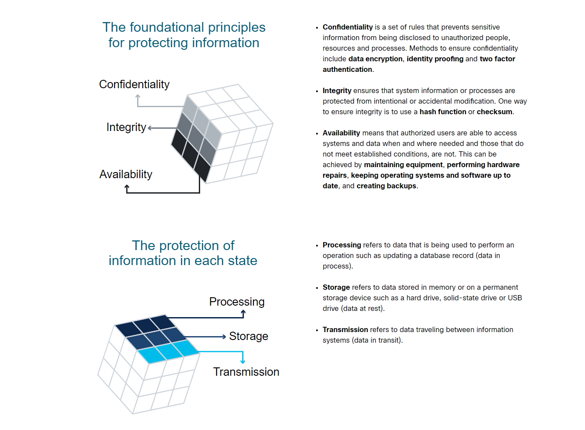
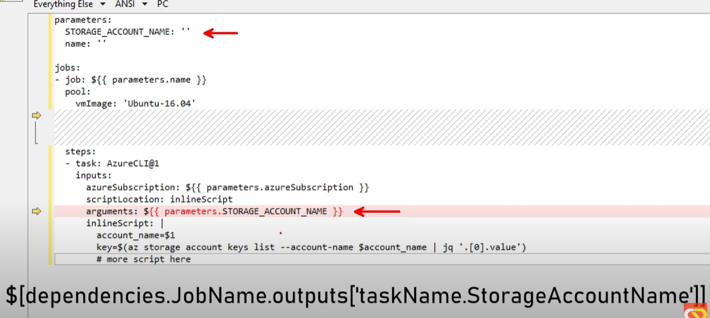
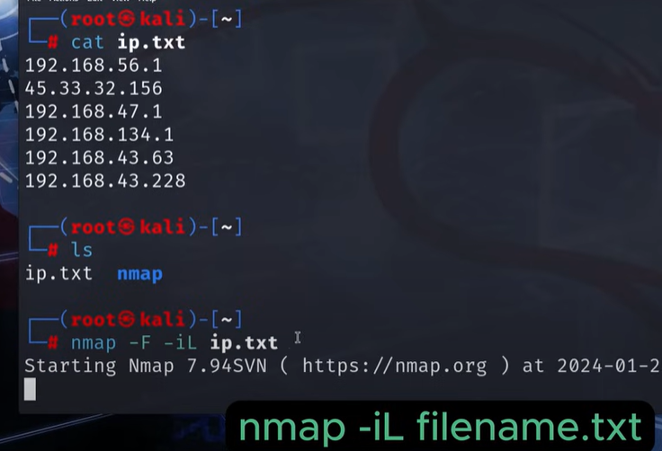
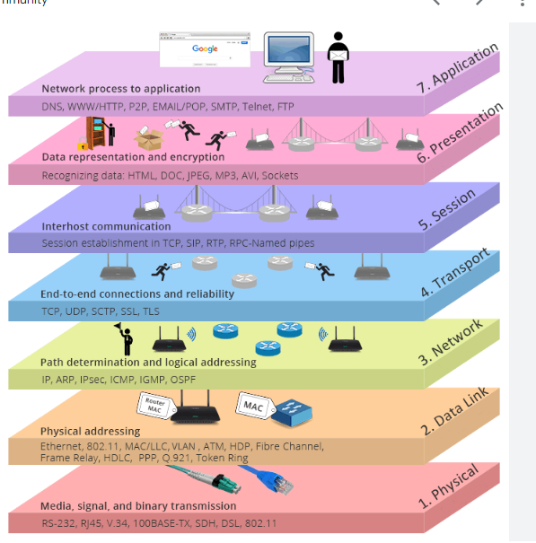
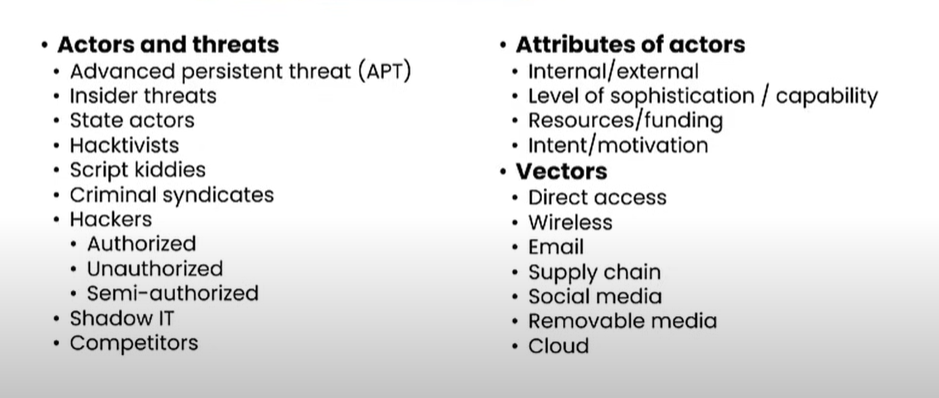
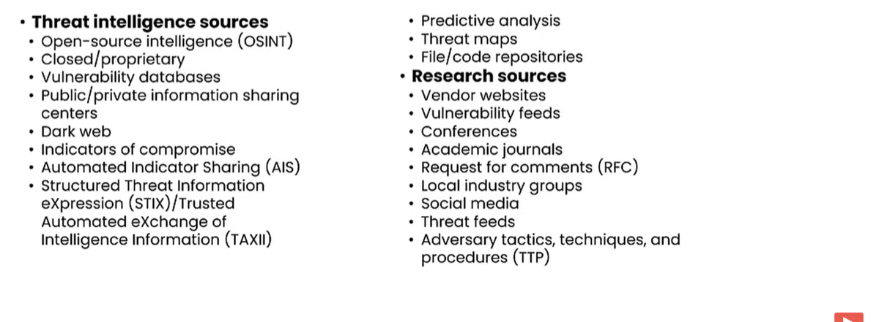
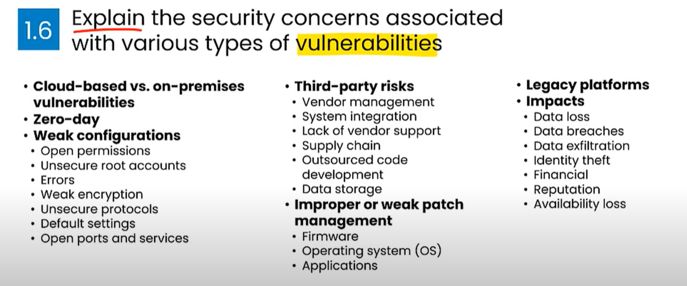

# Security

Overview of security information

## Table of contents

- [Security](#security)
  - [Table of contents](#table-of-contents)
  - [Basic Network Security](#basic-network-security)
    - [Weaknesses](#weaknesses)
  - [Terms](#terms)
  - [Set Up Security](#set-up-security)
  - [Search for](#search-for)
  - [Information Gathering](#information-gathering)
  - [Denial of Service](#denial-of-service)
    - [Network DOS](#network-dos)
    - [Application DOS](#application-dos)
    - [DDOS Distributed DOS](#ddos-distributed-dos)
    - [Operational Technology (OT) DOS](#operational-technology-ot-dos)
  - [Websites](#websites)
  - [Malware](#malware)
  - [Infiltration](#infiltration)
  - [Advanced Persistent Threats](#advanced-persistent-threats)
  - [Crypto](#crypto)
  - [Social Engineering Attacks](#social-engineering-attacks)
  - [Netowrk attacks](#netowrk-attacks)
  - [Application Attacks](#application-attacks)
  - [Threat Actors](#threat-actors)
  - [Methods of Attack](#methods-of-attack)
  - [Threat Intelligence Sources](#threat-intelligence-sources)

## Basic Network Security

All devices are connected to the router.
The router assigns your network ip addresses. A layer 3.

Breaking into a target network usually includes a number of steps. According to Lockheed Martin, the Cyber Kill Chain has seven steps:

1. Recon: Recon, short for reconnaissance, refers to the step where the attacker tries to learn as much as possible about the target. Information such as the types of servers, operating system, IP addresses, names of users, and email addresses, can help the attack’s success.
2. Weaponization: This step refers to preparing a file with a malicious component, for example, to provide the attacker with remote access.
3. Delivery: Delivery means delivering the “weaponized” file to the target via any feasible method, such as email or USB flash memory.
4. Exploitation: When the user opens the malicious file, their system executes the malicious component.
5. Installation: The previous step should install the malware on the target system.
   Command & Control (C2): The successful installation of the malware provides the attacker with a command and control ability over the target system.
6. Actions on Objectives: After gaining control over one target system, the attacker has achieved their objectives. One example objective is Data Exfiltration (stealing target’s data).

### Weaknesses

1. The internet
2. Device connected
3. Wireless router
4. Connection to other networks i.e. workstations at work

## Terms

SOHO - Small office home office.

## Set Up Security

How to secure devices and networks using devices and 3rd party software.

## Search for

Things we want to find or search in networks

## Information Gathering

First steps for hackers is to gathers as much OSINT as possible.
This online information gathering.
Using this data hackers can try and catch you in attacks. Either sending you a email virus with something you are interested in as the title. Or saying where you work. Creating files on the companies and people they are targetting will help make the overall job easier.

OSINT - open source information

The OSINT Framework is a tool that will search for usernames and emails across all sorts of social media.

`twint` twitter search

`. IP address`

## Denial of Service

Prevent a server from servicing real requests from clients by flooding traffic to the server.

### Network DOS

Fill up the network connection with enough bandwidth until devices cant keep up.

DDOS Distributed DOS is one of these - where you flood the server.
Maliciously formatted packers: A user could send a packet that the reciever cant handle. Causing the device to run slowly.

### Application DOS

Find bugs and vulnerabilities and send requests to the server that crash it.

### DDOS Distributed DOS

A Distributed DoS (DDoS) attack is similar to a DoS attack but originates from multiple, coordinated sources. For example:

An attacker builds a network (botnet) of infected hosts called zombies, which are controlled by handler systems.
The zombie computers will constantly scan and infect more hosts, creating more and more zombies.
When ready, the hacker will instruct the handler systems to make the botnet of zombies carry out a DDoS attack.

### Operational Technology (OT) DOS

This aims DOS at business systems and processing hardware and software.

## Websites

`pentest-tools.com` scan networks for weak spots

## Malware

Malicious Software that is used to bypass access controls and cause harm.

1. Spyware: Spyware will track and monitor all of your activity. It does this by modifying your security settings.
2. Adware: Downloaded with other software and delivers adverts to the user. Often comes with spyware.
3. Backdoor: Gains unathorized access to the system and grants remote access to hackers.
4. Randsomware: Encrypts your system files and randsoms them back to you. Spread through phishing emails.
5. Scareware: Scare you into doing something, often an OS message saying you need to buy something.
6. Rootkit: Rootkit will find a way to give you root access. They are very hard to detect and often require a reboot to remove.
7. Virus: A virus i a program when executed it replicates itself and attaches to executable files.
8. Trojan Horse: They carry out malicious operations while disguised as safe software.
9. Worms: Worms can run without a host and replicate and spread from pc to pc.

## Infiltration

1. Social engineering
2. DOS/DDOS
3. Botnet
4. On Path Attack - man in the middle
5. SEO posioning
6. Wifi password cracking
7. Password attacks
   1. Password spraying
   2. Dictionary attack
   3. Brute force
   4. Rainbow attacks - crack the hash
   5. Traffic interception. See the code

## Advanced Persistent Threats

Attackers also achieve infiltration through advanced persistent threats (APTs) — a multi-phase, long term, stealthy and advanced operation against a specific target. For these reasons, an individual attacker often lacks the skill set, resources or persistence to perform APTs.

Due to the complexity and the skill level required to carry out such an attack, an APT is usually well-funded and typically targets organizations or nations for business or political reasons.

Its main purpose is to deploy customized malware on one or more of the target’s systems and remain there undetected.

## Crypto

1. Cryptojacking

## Social Engineering Attacks

Two broad categories of social engineering attacks

1. Physics attacks
2. Virtual attacks

Is described as getting someone to do something they usually would not. i.e click and download a link.

## Netowrk attacks

1. Domain Hijacking
2. MAC flooding - forcing a unicast flooding (layer 2)
3. ARP poisioning/ ARP spoofing - changing MAC addresses (layer 2)  
4. MAC cloning - duplicate MAC addresses

## Application Attacks

1. Malicious code or script execution

## Threat Actors

A malicious person.

1. Advanced persistent threat APT
2. Insider threats
3. State actors
4. Hactavisists
5. Script Kiddies
6. Criminal syndicates
7. Hackers
8. Shadow IT
9. Competitors

## Methods of Attack

1. Direct access
2. Wireless
3. Emails
4. Supply chain
5. Social media
6. Cloud

## Threat Intelligence Sources

1. Public/Private info cneters - CISA agency shares information
2. Dark Web
3. Automated Indicator Sharing