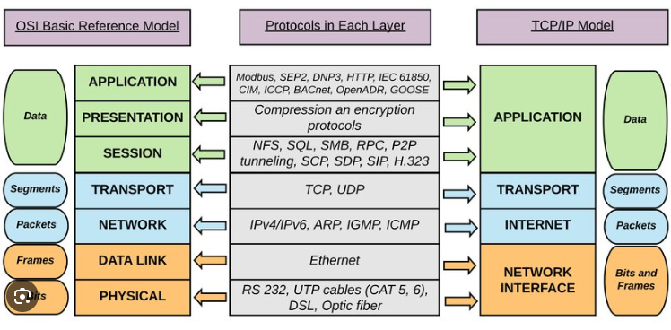
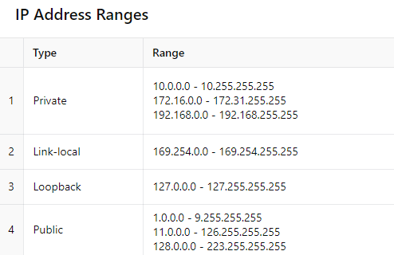
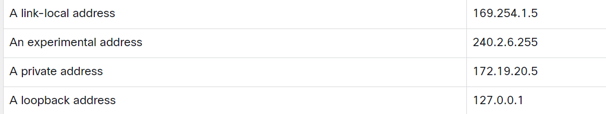

# TCP / IP

Transmission Control Protocol

## OSI and TCP

OSI model

1. Application
2. Presentation
3. Session
4. Transport
5. Network
6. Data Link
7. Physical
8. TCP / IP Model
9. Application
10. Transport
11. Network
12. Data Link
13. Physical

## Devices

Routers
Switches
Hubs

## TCP

SYN => SYN ACK => ACK

## Typles of casting

Unicast transmission refers to one device sending a message to one other device in one-to-one communications. A unicast packet has a destination IP address that is a unicast address which goes to a single recipient. A source IP address can only be a unicast address because the packet can only originate from a single source. This is regardless of whether the destination IP address is a unicast, broadcast or multicast. IPv4 unicast host addresses are in the address range of 1.1.1.1 to 223.255.255.255.

Broadcast transmission refers to a device sending a message to all the devices on a network in one-to-all communications. A broadcast packet has a destination IP address with all ones (1s) in the host portion, or 32 one (1) bits. A broadcast packet must be processed by all devices in the same broadcast domain. A broadcast may be directed or limited. A directed broadcast is sent to all hosts on a specific network. A limited broadcast is sent to 255.255.255.255. By default, routers do not forward broadcasts.

Multicast transmission reduces traffic by allowing a host to send a single packet to a selected set of hosts that subscribe to a multicast group. A multicast packet is a packet with a destination IP address that is a multicast address. IPv4 has reserved the 224.0.0.0 to 239.255.255.255 addresses as a multicast range. Each multicast group is represented by a single IPv4 multicast destination address. When an IPv4 host subscribes to a multicast group, the host processes packets addressed to this multicast address, and packets addressed to its uniquely allocated unicast address.

## IP addresses

In 1981, IPv4 addresses were assigned using classful addressing as defined in RFC 790 (https://tools.ietf.org/html/rfc790), Assigned Numbers. Customers were allocated a network address based on one of three classes, A, B, or C. The RFC divided the unicast ranges into specific classes as follows:

The are provided as `Static` or `Dynamic`

A `dhcp` server will give out an ip address

A broadcast packet with the devices Ip address and mac addreess will be broadcast by your device.

Class A (0.0.0.0/8 to 127.0.0.0/8) - Designed to support extremely large networks with more than 16 million host addresses.
Class B (128.0.0.0 /16 - 191.255.0.0 /16) - Designed to support the needs of moderate to large size networks with up to approximately 65,000 host addresses.
Class C (192.0.0.0 /24 - 223.255.255.0 /24) - Designed to support small networks with a maximum of 254 hosts.
There is also a Class D multicast block consisting of 224.0.0.0 to 239.0.0.0 and a Class E experimental address block consisting of 240.0.0.0 - 255.0.0.0.

The private IP address blocks that are used inside companies are as follows:

10.0.0.0 /8 (any address that starts with 10 in the first octet)
172.16.0.0 /12 (any address that starts with 172.16 in the first two octets through 172.31.255.255)
192.168.0.0 /16 (any address that starts with 192.168 in the first two octets)

### IPv6

IPv6 addresses are represented using hexadecimal numbers.

IPv6 is designed to be the successor to IPv4. IPv6 has a larger 128-bit address space, providing 340 undecillion (i.e., 340 followed by 36 zeroes) possible addresses. However, IPv6 is more than just larger addresses.

- Dual stack allows IPv4 and IPv6 to coexist on the same network segment. Dual stack devices run both IPv4 and IPv6 protocol stacks simultaneously. Known as native IPv6, this means the customer network has an IPv6 connection to their ISP and is able to access content found on the internet over IPv6.

- Tunneling is a method of transporting an IPv6 packet over an IPv4 network. The IPv6 packet is encapsulated inside an IPv4 packet, similar to other types of data.

- Network Address Translation 64 (NAT64) allows IPv6-enabled devices to communicate with IPv4-enabled devices using a translation technique similar to NAT for IPv4. An IPv6 packet is translated to an IPv4 packet and an IPv4 packet is translated to an IPv6 packet.

There are two rules to help reduce the notation of IPv6 addresses. The first one is to omit any leading 0s (zeros) in any hextet. The second one is that a double colon (::) can replace any single, contiguous string of one or more 16-bit hextets consisting of all zeros, but the double colon (::) can only be used once within an address. If an address has more than one contiguous string of all-0 hextets, the best practice is to use the double colon (::) on the longest string. So, applying the first rule in the IPv6 address we have 2001:db8:0:0:ab00:0:0:0, and applying the second rule results in 2001:db8:0:0:ab00::

### DHCP

Dynamic Host Configuration Protocol

Here are the matches for each description with the appropriate DHCP message:

The DHCP processes in order are:

DHCPDISCOVER
DHCPOFFER
DHCPREQUEST
DHCPACK

During which two steps will the client PC use broadcast messages when communicating with a DHCP server?
DHCPDISCOVER
DHCPREQUEST

All DHCP messages between a DHCP-enabled client and a DHCP server use broadcast messages until after the DHCPACK message. The DHCPDISCOVER and DHCPREQUEST messages are the ones sent by a DHCP-enabled client using broadcast messages when the client is obtaining a lease for the first time.

The correct order in which DHCP messages are sent between a host and a DHCP server is:

discover, offer, request, acknowledgment

## Gateways

A way for networks to leave and use another network.
When a computer needs to forward to a destination that is not connected to themselves. Based on if the network portion of the address is the same as the local network.

### Default Gateway

A Default Gateway is a router interface that traffic will come to first. 

